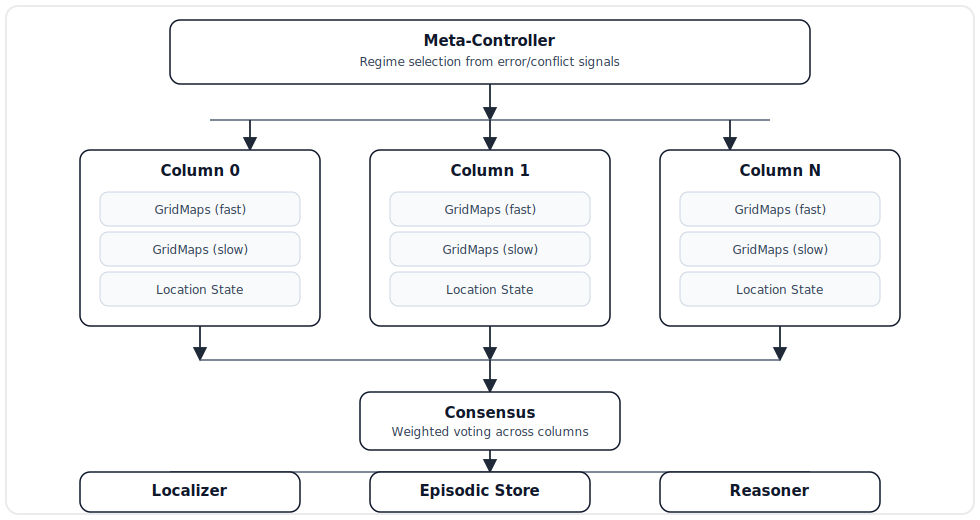

# DS001 - Vision: Discrete CPU-First Learning Architecture

**Status:** Draft  
**Version:** 0.6  
**Last Updated:** 2026-01-26

---

## Reading Order for Implementers

This project is designed to be implementable by a Node.js engineer without ML background, but the **reading order matters**.

Recommended order:

1. **DS001:** read §3 (Architecture Overview) + §4 (Glossary) first (skip §2 unless you want the rationale).
2. **DS004:** core runtime algorithms (keep it open while coding).
3. **DS002b:** implementation guide (phases, entry points, end-to-end examples).
4. **DS002a:** API reference while implementing modules under `src/`.
5. **DS003:** experiments + success criteria (what “working” means).
6. **DS005:** integrations (LLM extraction, validation, retrieval/derivation/conflict rules, answer contract) when implementing Exp3.

## 1. Executive Summary

This document describes the architectural vision for VSABrains: a discrete, CPU-first learning system inspired by *A Thousand Brains* (Hawkins et al.). The goal is to demonstrate that robust intelligence can emerge from parallel models operating in reference frames, achieving consensus through voting, without requiring GPU-accelerated dense neural networks.

The system targets two concrete use cases:
1. **Domain Expert**: Incremental absorption of domain knowledge with version management, paraphrase unification, rule composition, and long-context coherence.
2. **Verifiable RAG**: Retrieval-augmented generation where every emitted proposition is traceable to source facts, with explicit verdicts (`supported`, `conflicting`, `unsupported`).

---

## 2. The Fundamental Problem: Why Not Global Superposition?

### 2.1 The "Muddiness" Problem

Vector Symbolic Architectures (VSA) and related global superposition schemes attempt to compress entire timelines into single holographic vectors. Our experiments revealed a structural limitation: **performance collapses rapidly with sequence length**.

The probability of correctly recovering a window of L consecutive steps decreases dramatically as more events are superposed. This is not an implementation issue—it is inherent to global superposition.

### 2.2 Our Solution: Order as Address

Instead of encoding temporal order as superposed content, we encode it as **location/address** in memory:

| Global Superposition | Our Approach |
|---------------------|--------------|
| Events mixed into one vector | Events written along trajectories |
| Order encoded in content | Order encoded as position |
| Retrieval is probabilistic | Retrieval is deterministic |
| Verification is weak | Verification is strong (auditable) |

This architectural choice makes verification powerful: verdicts (`supported`/`conflicting`/`unsupported`) are based on deterministic reconstruction from addressable evidence, not on "trust" in a saturated global representation.

---

## 3. Architecture Overview

### 3.1 Core Components




### 3.2 Where the Detailed Specs Live

To keep specs smaller and easier to implement, detailed specifications are split into:

- [DS004 - Core Algorithms and Data Structures](DS004-Algorithms-and-Data-Structures.md): the discrete runtime (steps, `GridMap`s, displacement, localization, replay/checkpoints, reasoning primitives, diagnostics).
- [DS005 - Integrations and Non-Core Implementation](DS005-Integrations-and-Non-Core.md): text ingestion, LLM-backed extraction, fact validation, retrieval/derivation/conflict rules, and the verifiable answer contract.
- [DS003 - Evaluation Framework](DS003-Eval.md): experiment definitions, datasets, metrics, and success criteria (what “working” means).
- DS002 is split into:
  - `DS002b-Implementation-Guide.md`: phases, wiring, end-to-end examples, and milestones.
  - `DS002a-API-Reference.md`: file-level module APIs to implement under `src/`.

If you are implementing the system, start with DS004 (core runtime), then DS005 (optional integrations).

## 4. Glossary

This glossary defines project terms used across the design specifications.

When a term has important implementation details, the entry includes a reference to the specification that defines it (typically DS004).

### 4.1 Core Terms

#### Token ID (`tokenId`)

A deterministic integer used to represent a discrete symbol (word token, entity ID, predicate ID, summary token, etc.).

Implementation: DS004 §3 (data model), DS002a (`util/Vocabulary.mjs`, `util/Tokenizer.mjs`).

#### Step Token ID (`stepTokenId`)

The primary `tokenId` for a step. It drives:
- displacement (movement)
- localization indexing (`LocationIndex`)

Implementation: DS004 §3.1, DS004 §5 (displacement).

#### Write Tokens (`writeTokenIds`)

Zero or more auxiliary `tokenId`s written into the current grid cell for later retrieval/reasoning.

Implementation: DS004 §3.1 (token conventions), DS004 §2.1 (step ingestion).

#### Location Key (`locKey`)

A packed 32-bit integer derived from `(x, y)` grid coordinates for fast equality checks.

Implementation: DS004 §3.3 and DS004 §6 (localization).

### 4.2 Algorithms and Concepts

#### Heavy-Hitters

A streaming algorithm that keeps a bounded **top-K** set of most frequent items seen so far, using bounded memory.

In VSABrains, each grid cell maintains a heavy-hitters summary of token IDs to prevent local “muddiness” (cell saturation).

Implementer intuition:
- Think “**LFU cache** for a stream”: each cell can only remember K token IDs; each write increments a counter; when full, the least-important item is evicted.
- This prevents a single cell from accumulating an unbounded bag of tokens, which would destroy retrieval quality.

Example (K=4):

```text
stream: [A, B, A, C, A, D, E, A]
top-4:  [(A,4), (B,1), (C,1), (D,1)]  // E is evicted at capacity
```

Implementation: DS004 §4 (`GridMap` + heavy-hitters cells), DS002a `core/HeavyHitters.mjs`.

#### Toroidal Topology (“Pac-Man wrap”)

A grid topology where moving past an edge wraps around to the opposite edge:
- `x = wrap(x + dx, width)`
- `y = wrap(y + dy, height)`

This avoids edge effects and keeps movement rules uniform.

Implementer intuition:
- Wrapping avoids “edge bugs”: with clamping, trajectories can stick to borders and distort localization statistics.
- Wrapping makes displacement behavior location-independent (same rules everywhere), which simplifies debugging and analysis.

Implementation: DS004 §5.2 (wrapping), DS004 §2.1 (`stepMove`).

#### Coreference Resolution

Resolving references like pronouns (“he”, “she”, “it”) or aliases back to the entity they refer to.

In Exp2, this typically means tracking the most recently mentioned entity so “he” can be mapped to the correct subject.

Implementation: DS003 §3 (Exp2 narrative coherence).

#### Work Signature

An explicit role→value map used for auditable reasoning.

Analogy: a JavaScript `Map` (or plain object) that binds roles like `subject`, `predicate`, `object` to concrete values, optionally including variables for pattern matching.

Implementer intuition:
- It is *not* just an object because we need: deterministic hashing/canonicalization, explicit variable tracking, conflict-checked merges, and pattern matching (“unification”).
- Using a dedicated structure makes reasoning auditable and testable (you can inspect exactly what is bound to what).

Implementation: DS004 §8 (reasoning primitives), DS002a `reasoning/WorkSignature.mjs`.

#### Reference Frame Alignment

In this project, a “reference frame” is the internal coordinate system of a column’s maps (different columns have different seeds/offsets).

“Alignment” is the practical problem: given a recent window of step tokens, **find the most likely current location** in that column’s grid (like “where am I?”).

Implementer intuition:
- Think “GPS localization”: the window is your observation; `LocationIndex` is a fast lookup of plausible places; replay verification checks whether the implied trajectory actually matches what’s stored.

Implementation: DS004 §6 (localization), DS003 Exp1/Exp2.

## 5. Success Criteria

The architecture succeeds if:

1. **Coherence scales**: Long narratives do not cause catastrophic interference
2. **Localization is robust**: Top-K + replay handles repetitive motifs
3. **Verdicts are accurate**: `supported` answers are correct; `unsupported` triggers refusal
4. **Conflicts are detected**: Incompatible facts are surfaced, not silently resolved
5. **Generalization works**: Patterns learned with canonical variables apply to new entities

---

## 6. References

- Hawkins, J., et al. *A Thousand Brains: A New Theory of Intelligence* (2021)
- Kanerva, P. *Hyperdimensional Computing: An Introduction to Computing in Distributed Representation* (2009)
- Project experiments: Internal simulation logs (VSA interference tests, localization under repetition, binding/unbinding OOD tests)
