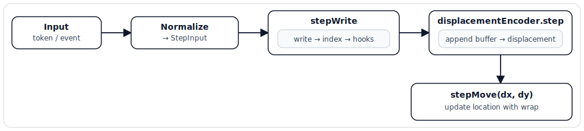
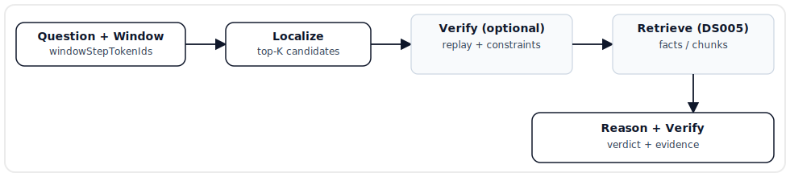

# DS004 - Core Algorithms and Data Structures

**Status:** Draft  
**Version:** 0.2  
**Last Updated:** 2026-01-26

---

## 1. Scope

This specification defines the **core discrete runtime** of VSABrains: how steps are represented, written into `GridMap`s, localized, replayed, and verified.

Out of scope (documented separately):
- Text ingestion and verifiable RAG integration (DS005: retrieval, conflict rules, derivation, answer contract)
- High-level architectural rationale (DS001)
- Concrete module breakdown and implementation sequencing (DS002b; file-level APIs in DS002a)
- Experiment definitions and metrics (DS003)

---

## 2. Core Happy Path (Runtime)

The system is designed around a deterministic **step clock**.

### 2.1 Step Ingestion (per step)

1. Normalize input into a `StepInput` (see §3.2).
2. `Column.stepWrite(stepInput, step)`:
   - write `writeTokenIds` into the current cell
   - update `LocationIndex` for `stepTokenId` (record `lastSeen = step`)
   - append the event to the episodic store (optional; depends on experiment)
3. Update the displacement context buffer with `stepTokenId`, then compute displacement (see §5).
4. `Column.stepMove({ dx, dy })` (wrap-around “Pac-Man style”; see [DS001 Glossary](DS001-Vision.md#4-glossary)).
5. Update diagnostics counters (see §11).

**Definitive ordering (no ambiguity):**
- The write for step `N` happens at the **pre-move location**.
- The displacement applied at the end of step `N` is computed **after** adding `stepTokenId[N]` to the displacement buffer. This means the current token influences its own movement.

### 2.2 Query-Time (high level)

1. `Localizer.localize(windowStepTokenIds)` returns candidate locations (see §6).
2. Candidates are optionally **verified by replay** (`Verifier` + `Replayer`) before answering.
3. The system returns an explicit verdict: `supported`, `conflicting`, or `unsupported` (see DS005 for the full answer contract).

### 2.3 Step Flow Diagram



### 2.4 Query Flow Diagram



### 2.5 Worked Example: 3 Steps (Write → Buffer → Move)

This example shows the definitive ordering and how displacement affects location.

Config (illustrative):
- `gridSize = 64`, initial `location = (32, 32)`
- `contextLength = 2`, `maxStep = 3`, `seed = 0`

Notes:
- Writes happen at the **pre-move** location.
- The displacement applied on step `N` is computed **after** adding `stepTokenId[N]` to the buffer.
- Hash outputs below are illustrative; the implementation uses deterministic hashing (`src/util/hash.mjs`).

```text
Step 0:
  pre-move location = (32, 32)
  input stepTokenId = 100, writeTokenIds = [100]
  write: GridMap.update(32, 32, 100)
  index: LocationIndex.update(100, 32, 32, step=0)
  buffer after append = [100]
  assume murmurHash32(...) = 0x00010002
    dx = (h % 7) - 3 = (4) - 3 = +1
    dy = ((h >> 16) % 7) - 3 = (1) - 3 = -2
  post-move location = (33, 30)

Step 1:
  pre-move location = (33, 30)
  input stepTokenId = 200, writeTokenIds = [200]
  write: GridMap.update(33, 30, 200)
  index: LocationIndex.update(200, 33, 30, step=1)
  buffer after append = [100, 200]
  assume murmurHash32(...) = 0x00030001
    dx = (0) - 3 = -3
    dy = (3) - 3 =  0
  post-move location = (30, 30)

Step 2:
  pre-move location = (30, 30)
  input stepTokenId = 300, writeTokenIds = [300]
  write: GridMap.update(30, 30, 300)
  index: LocationIndex.update(300, 30, 30, step=2)
  buffer after append (contextLength=2) = [200, 300]
  assume murmurHash32(...) = 0x00040004
    dx = (5) - 3 = +2
    dy = (4) - 3 = +1
  post-move location = (32, 31)
```

### 2.6 Controller/Column Pseudocode (Happy Path)

This pseudocode is intentionally explicit about ordering and parameters.

```javascript
function normalizeInput(input) {
  if (typeof input === 'number') {
    return { stepTokenId: input, writeTokenIds: [input] };
  }
  if (Array.isArray(input)) {
    return { stepTokenId: hashCombineU32(input), writeTokenIds: input };
  }
  return input; // { stepTokenId, writeTokenIds, event? }
}

async function controllerStep(input) {
  const stepInput = normalizeInput(input);
  const step = this.stepCounter;

  for (const column of this.columns) {
    // 1) write at pre-move location
    column.stepWrite(stepInput, step);

    // 2) append to buffer, then compute displacement
    const displacement = column.displacementEncoder.step(stepInput.stepTokenId);

    // 3) move once per step
    column.stepMove(displacement);
  }

  this.stepCounter++;
}

function columnStepWrite(stepInput, step) {
  const { stepTokenId, writeTokenIds, event } = stepInput;
  const { x, y } = this.location; // pre-move location

  // Write auxiliary tokens (bounded by Heavy-Hitters K per cell).
  for (const tokenId of writeTokenIds) {
    this.fastMap.update(x, y, tokenId, 1.0);
  }

  // Index the primary step token for localization.
  this.locationIndex.update(stepTokenId, x, y, step);

  // Optional hooks.
  if (this.slowMapManager) this.slowMapManager.onStep(event, { x, y }, step);
  if (this.episodicStore && event) this.episodicStore.append({ step, event });
}
```

---

## 3. Data Model and Terminology

### 3.1 Tokens

- `tokenId` is the generic discrete symbol ID used everywhere.
- `stepTokenId` is the **primary** token ID for the step (used for displacement and localization indexing).
- `writeTokenIds` are the **auxiliary** token IDs written into the current cell for later retrieval/reasoning.

This distinction keeps indexing and displacement bounded while still allowing richer writes per step.

### 3.1.1 Column / Map / Cell (Terminology)

VSABrains uses these terms in a very specific hierarchy:


Notes:
- A **column** owns multiple maps plus its own location and encoders.
- A **map** is a 2D grid inside a column.
- A **cell** is the per-location heavy-hitters structure that stores top-K token IDs.

### 3.2 Step Input


```javascript
/**
 * @typedef {number} TokenId
 * @typedef {number} Step
 *
 * @typedef {{ x: number, y: number }} Location
 * @typedef {number} LocKey
 *
 * @typedef {{
 *   stepTokenId: TokenId,
 *   writeTokenIds: TokenId[],
 *   event?: object, // opaque, experiment-dependent metadata
 * }} StepInput
 */
```


`step` is a monotonically increasing counter owned by the controller/runtime. It is passed separately to write/indexing methods so that indices can track recency (`lastSeen`).

`event` is treated as **opaque** by the core runtime. It is only forwarded to optional hooks (episodic store, slow-map summaries). Event schemas are experiment-dependent:
- Exp2 narrative events: see DS003 (encoding helpers and event shapes).
- Exp3 ingestion pipelines may attach chunk/fact metadata: see DS005.

Normalization rules (baseline):
- If input is `tokenId: number` → `stepTokenId = tokenId`, `writeTokenIds = [tokenId]`
- If input is `tokenIds: number[]` → `writeTokenIds = tokenIds`, `stepTokenId = hashCombineU32(writeTokenIds)`
- If input is `{ stepTokenId, writeTokenIds }` → use as-is

### 3.3 Location Keys (`locKey`)

For fast equality checks, locations are represented as a packed 32-bit `locKey`:

```javascript
export function packLocKey(x, y) {
  return (((x & 0xffff) << 16) | (y & 0xffff)) >>> 0;
}

export function unpackLocKey(locKey) {
  return { x: locKey >>> 16, y: locKey & 0xffff };
}
```

Constraint: this packing assumes `0 <= x,y < 65536` (true for typical grid sizes).

### 3.4 Localization Candidate Shape


```javascript
/**
 * @typedef {{
 *   columnId: string,
 *   locKey: LocKey,
 *   location: Location,
 *   score: number,          // match ratio in [0, 1]
 *   matches?: number,       // number of tokens matched
 *   lastSeenMax?: Step,     // max recency among matched tokens
 *   verifiedScore?: number, // optional replay-based score
 * }} LocalizationCandidate
 */
```


### 3.5 Hashing and Collisions (Practical Note)

Hashing is used for displacement and (optionally) for bounded vocabularies. Hash collisions are possible.

Policy:
- Collisions are treated as **rare noise** and are acceptable in early prototypes.
- For critical evaluation and reasoning, prefer `Vocabulary` in `mode='dynamic'` to guarantee uniqueness of token IDs (see DS002a `util/Vocabulary.mjs`).
- If `mode='hash'` is used, expect occasional aliasing: unrelated symbols may become indistinguishable, degrading localization and reasoning quality.

---

## 4. GridMap and Heavy-Hitters Cells

A `GridMap` is a 2D grid (dense array or sparse hash-grid). Each cell stores a bounded **heavy-hitters** summary (see [DS001 Glossary](DS001-Vision.md#4-glossary)):
- Keep only the top-K token IDs by frequency (optionally with recency tie-breakers).
- Reads are deterministic and auditable: `readTopK(x, y, k)` returns a ranked list.

Required operations (conceptual contract):
- `update(x, y, tokenId, weight)` → write one token into one cell
- `readTopK(x, y, k)` → `Array<[tokenId, count]>`
- `stats()` → utilization and saturation metrics

Saturation monitoring (recommended):
- `cellSaturation = cellsAtFullCapacity / nonEmptyCells`
- If `cellSaturation > 0.8`, increase grid size or reduce write rate.

Runtime behavior (recommended):
- Do not crash or throw on saturation. Continue with degraded quality, but record a diagnostic signal (see §11) so the meta-controller and evaluation harness can react.

### 4.1 Dense vs Sparse Storage (Implementation Choice)

This is an implementation detail (does not change semantics).

Recommendation:

| Grid size | Storage | Rationale |
|-----------|---------|-----------|
| `<= 128×128` | dense 2D array | simplest and fast; memory is still small |
| `> 128×128` | sparse `Map<locKey, Cell>` | avoid allocating mostly-empty grids |

---

## 5. Displacement (Order as Address)

Displacement turns a short history of `stepTokenId`s into a bounded `(dx, dy)` move.

### 5.1 Displacement Encoder (per column)

Each column owns a displacement context buffer:
- stores the last `contextLength` **step tokens**
- updated once per step after input normalization

Recommended API (aligns with DS002a):

```javascript
export class DisplacementEncoder {
  constructor({ contextLength = 2, maxStep = 3, seed = 0, avoidZeroStep = false } = {}) {}

  /** Pure function: does not mutate internal buffer. */
  encode(recentStepTokenIds) {}

  /**
   * Called exactly once per step.
   * Ordering: append stepTokenId to the internal buffer, then compute displacement from the buffer.
   */
  step(stepTokenId) {}

  reset() {}
}
```

### 5.2 Deterministic Displacement Function

```javascript
function computeDisplacement(recentStepTokenIds, config) {
  const contextLength = config.contextLength ?? 2;
  const maxStep = config.maxStep ?? 3;
  const seed = config.seed ?? 0;

  const recent = recentStepTokenIds.slice(-contextLength);
  const combined = hashCombineU32(recent, seed);
  const h = murmurHash32(combined, seed);

  let dx = (h % (2 * maxStep + 1)) - maxStep;
  let dy = ((h >>> 16) % (2 * maxStep + 1)) - maxStep;

  if (config.avoidZeroStep && dx === 0 && dy === 0) {
    const dir = (h >>> 24) & 3;
    if (dir === 0) dx = 1;
    else if (dir === 1) dx = -1;
    else if (dir === 2) dy = 1;
    else dy = -1;
  }

  return { dx, dy };
}
```

`hashCombineU32(...)` and `murmurHash32(...)` are deterministic utilities defined in `src/util/hash.mjs` (see DS002a).

### 5.3 Hash Utilities: When to Use Which

| Use case | Function |
|----------|----------|
| Combine multiple token IDs into one `stepTokenId` | `hashCombineU32(tokenIds, seed)` |
| Final displacement computation from combined context | `murmurHash32(u32, seed)` |
| Hash a string when using bounded vocabularies | `hashString(str, seed)` |

Wrapping (toroidal topology; see [DS001 Glossary](DS001-Vision.md#4-glossary)) is recommended:

```javascript
function wrap(n, size) {
  return ((n % size) + size) % size;
}
```

---

## 6. Localization (Top-K Frame Alignment)

Localization answers: “Given the recent window of step tokens, what are the most likely current locations?”

### 6.1 LocationIndex

Maintain an inverted index **per column**:

- `stepTokenId → Map<locKey, { count, lastSeen }>`

This index is updated during `Column.stepWrite()` for the `stepTokenId` only.

Definitive `LocationIndex.update(...)` signature (aligns with DS002a):

```javascript
// Called when writing a step token at the current (pre-move) location.
update(stepTokenId, x, y, step) {
  const locKey = packLocKey(x, y);
  // tokenToLocations.get(stepTokenId).get(locKey) = { count: count+1, lastSeen: step }
}
```

`LocationIndex.getCandidates(stepTokenId, limit)` returns a bounded array of:

```javascript
// Sorted by (count desc, lastSeen desc), length <= limit.
[{ locKey, count, lastSeen }]
```

Memory bounding (recommended):
- Maintain `maxLocationsPerToken` (e.g., `500`) to cap memory per token.
- Prune deterministically when a token exceeds the cap by keeping the top entries by `(count desc, lastSeen desc)`.

Conceptual pruning pseudocode:

```javascript
function pruneTokenLocations(locMap, maxLocationsPerToken) {
  if (locMap.size <= maxLocationsPerToken) return;
  const sorted = [...locMap.entries()].sort(
    (a, b) => b[1].count - a[1].count || b[1].lastSeen - a[1].lastSeen
  );
  locMap.clear();
  for (let i = 0; i < maxLocationsPerToken && i < sorted.length; i++) {
    locMap.set(sorted[i][0], sorted[i][1]);
  }
}
```

### 6.2 Baseline Localization Algorithm

Inputs:
- `windowStepTokenIds: TokenId[]`
- `candidatesPerToken` (bounded)
- `topK`

Pseudocode (single column):

```javascript
async function localize(windowStepTokenIds, locationIndex, topK = 20, config = {}) {
  const candidatesPerToken = config.candidatesPerToken ?? 50;
  const minMatchesRatio = config.minMatchesRatio ?? 0.6;
  const minMatches = Math.ceil(windowStepTokenIds.length * minMatchesRatio);

  // 1) Fetch bounded candidate lists.
  const perToken = windowStepTokenIds.map((tok) => locationIndex.getCandidates(tok, candidatesPerToken));

  // 2) Anchor on the rarest token (smallest candidate list).
  let anchorIdx = 0;
  for (let i = 1; i < perToken.length; i++) {
    if (perToken[i].length < perToken[anchorIdx].length) anchorIdx = i;
  }

  // 3) Seed candidates from anchor token by locKey.
  const byLocKey = new Map(); // locKey -> { matches, lastSeenMax }
  for (const c of perToken[anchorIdx]) {
    byLocKey.set(c.locKey, { matches: 1, lastSeenMax: c.lastSeen });
  }

  // 4) Soft-intersect: only keep locKeys also supported by other tokens.
  for (let i = 0; i < perToken.length; i++) {
    if (i === anchorIdx) continue;
    for (const c of perToken[i]) {
      const entry = byLocKey.get(c.locKey);
      if (!entry) continue;
      entry.matches++;
      entry.lastSeenMax = Math.max(entry.lastSeenMax, c.lastSeen);
    }
  }

  // 5) Rank.
  const candidates = [];
  for (const [locKey, data] of byLocKey.entries()) {
    if (data.matches < minMatches) continue;
    const location = unpackLocKey(locKey);
    candidates.push({
      columnId: config.columnId ?? 'column0',
      locKey,
      location,
      matches: data.matches,
      lastSeenMax: data.lastSeenMax,
      score: data.matches / windowStepTokenIds.length,
    });
  }

  candidates.sort((a, b) => b.score - a.score || (b.lastSeenMax ?? 0) - (a.lastSeenMax ?? 0));
  const top = candidates.slice(0, topK);

  if (config.debug) {
    return {
      candidates: top,
      stats: {
        perTokenCandidates: perToken.map((arr) => arr.length),
        anchorIdx,
        scoredLocations: byLocKey.size,
      },
    };
  }

  return top;
}
```

### 6.3 Optional Verification by Replay

For each candidate location:
- Replay displacement over the same `windowStepTokenIds`
- At each visited cell, check whether the expected token exists in `GridMap.readTopK(...)`
- Accumulate a deterministic `verifiedScore`

Candidates can then be re-ranked by `verifiedScore` (or combined with the index score).

---

## 7. Replay and Checkpointing

Replay reconstructs state by applying events from an earlier checkpoint up to a target step.

Clarification:
- Replay requires an **ordered event stream** (e.g., an episodic/event store with a range query API).
- The **state semantics are experiment-dependent** (Exp2 narrative state vs Exp3 fact state). The replay engine should be parameterized by a state accumulator (e.g., `applyEventToState(state, event)`).
- GridMap cells are not treated as a lossless source of structured state (heavy-hitters truncation is lossy). Use GridMaps for localization and optional verification; use replayed events/facts for auditable state.

### 7.1 What a Checkpoint Must Contain

Checkpoints must capture **minimal state needed to resume deterministically**. A recommended schema:

```javascript
const checkpointSchema = {
  step: 123,
  columns: [
    {
      id: 'primary',
      location: { x: 10, y: 22 },
      displacementBuffer: [111, 222], // last N stepTokenIds (contextLength)
    },
  ],

  // Optional, experiment-dependent:
  workpad: { bindings: [['?x', 'S:Alice']] },
  // Only required if replay re-encodes unresolved pronouns.
  // Recommended for Exp2: store `resolvedSubject` in the event stream (DS003), keeping this optional.
  corefState: { lastEntityId: 'S:Alice' },
};
```

**Explicit non-goal:** serializing full `GridMap`s inside checkpoints (too large). Grid content is either:
- kept in-memory (online), or
- reconstructed by replay from the episodic store when needed.

### 7.2 When to Checkpoint

Baseline policies:
- fixed interval (e.g., every 100 steps), or
- adaptive triggers (scene reset, new entity introduced, prediction error spike, verifier conflict)

---

## 8. Reasoning Primitives (Work Signatures)

For auditable reasoning, VSABrains uses explicit structural bindings rather than vector superposition.

- `WorkSignature`: a role→value map (see [DS001 Glossary](DS001-Vision.md#4-glossary)).
- Pattern matching binds variables to constants.
- `Workpad` stores variable bindings and supports backtracking.

These primitives are intentionally deterministic and inspectable.

### 8.1 Unification (matchPattern)

Variables are represented as strings prefixed with `?` (e.g., `'?x'`).

Unification matches a pattern against a fact signature and produces variable bindings:
- Pattern: role→value map where values may be constants or variables (`?name`).
- Fact: role→value map where values are constants.
- Output: `Map<variable, constant>` or `null` if no match.

Conceptual algorithm:

```javascript
function isVariable(v) {
  return typeof v === 'string' && v.startsWith('?');
}

function matchPattern(pattern, fact) {
  const bindings = new Map();

  for (const [role, patternValue] of Object.entries(pattern)) {
    const factValue = fact[role];

    if (isVariable(patternValue)) {
      if (bindings.has(patternValue) && bindings.get(patternValue) !== factValue) return null;
      bindings.set(patternValue, factValue);
      continue;
    }

    if (patternValue !== factValue) return null;
  }

  return bindings;
}
```

Example:

```javascript
matchPattern(
  { subject: '?x', predicate: 'enters', object: 'room_A' },
  { subject: 'Alice', predicate: 'enters', object: 'room_A' }
); // => Map { '?x' => 'Alice' }
```

Derivation algorithms (goal-directed multi-hop reasoning) and fact-level conflict detection are integration layers specified in DS005. DS004 only defines the deterministic binding/unification primitives those layers use.

---

## 9. Multi-Timescale Memory (Slow Maps)

Slow maps store coarser summaries at a lower write frequency to mitigate fast-map saturation.

### 9.1 Window Semantics

`windowSize` is measured in **steps** (one `Column.stepWrite(..., step)` call per step). A slow-map write is triggered when `windowSize` steps have been accumulated.

Fast maps vs slow maps (baseline):
- Fast map(s) are written on every step.
- Slow map writes are optional and enabled by configuration/regime; when enabled, `Column.stepWrite(...)` calls `slowMapManager.onStep(...)` before movement.

### 9.2 Flush Procedure (Definitive)

`SlowMapManager.onStep(event, location, step)`:
1. Accumulate `event` into the current `WindowSummary`.
2. If `(step + 1) % windowSize === 0`, call `flushWindow(location, step)`.

`flushWindow(location, step)`:
1. Finalize the window time range.
2. Compute `summaryTokenId = windowSummary.toTokenId(...)` (deterministic).
3. Write `summaryTokenId` into the slow `GridMap` at the **current pre-move location**.
4. Store the structured summary object in a summary store keyed by `summaryTokenId`.
5. Optionally index `summaryTokenId` in a slow-map `LocationIndex` for coarse localization.

Index note:
- `Column.locationIndex` indexes `stepTokenId` writes (fast-map, per step).
- `SlowMapManager.locationIndex` (if configured) indexes `summaryTokenId` writes (slow-map, per window). These are separate indices.

### 9.3 What Summaries Must Preserve

Minimal requirements for summaries:
- time range
- entity IDs
- key predicates / state changes

Summaries can be tokenized into a `summaryTokenId` (via hashing) and written into a slow map, while also storing a structured summary object for audit/replay.

### 9.4 Relationship to Checkpointing

Slow-map flushing and checkpointing are independent, but a common practice is to checkpoint on (or near) window boundaries so that replay and summary windows line up cleanly for debugging.

---

## 10. Multi-Column Consensus and Regimes

Columns differ by:
- displacement seed
- initial location offset
- optional grid sizes / K values

Consensus (baseline):
- majority vote over per-column predictions
- confidence = winnerScore / totalScore

Regime selection (meta-controller) uses auditable triggers:
- prediction error MA spikes → switch to learning
- persistent saturation → consolidation (enable slow maps / increase capacity)
- low localization confidence → increase localization budget / keep multiple hypotheses

---

## 11. Diagnostics and Deterministic Failure Handling

Track (recommended):
- grid utilization, cell saturation
- revisit rate / zero-step rate
- localization entropy and top-1 confidence
- prediction error MA
- column agreement
- replay cost (avg replay steps)

When ambiguous or failing, degrade **auditably**:
- no candidates → widen window / increase topK / return `unsupported`
- low confidence → keep multiple hypotheses
- checkpoint missing → replay from earlier checkpoint; cap replay; otherwise refuse
- verifier conflict → return `conflicting` with minimal conflict chain
- persistent saturation → record a saturation warning; optionally switch regimes (enable slow maps / increase capacity)
